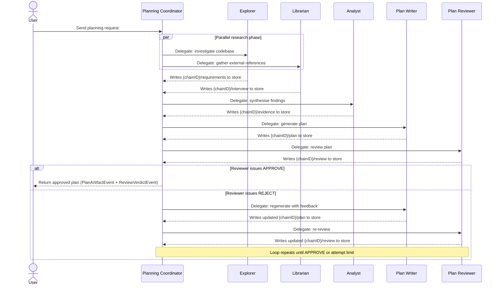

# Planning Loop

The Planning Loop is a deterministic, multi-agent workflow that transforms a natural-language request into a reviewed, executable plan. Three roles collaborate in a fixed sequence: the **Planning Coordinator** orchestrates, the **Plan Writer** generates, and the **Plan Reviewer** validates.

## Overview

The coordinator never writes a plan itself. Instead, it fires specialist agents in a specific order and uses the [Coordination Store](./RESEARCH_AGENTS.md#coordination-store) to share findings between them. The loop repeats the write–review cycle until the reviewer issues an APPROVE verdict or a configurable attempt limit is reached.



## Agent Roles

### Planning Coordinator

- **Manifest**: `agents/planning-coordinator.json`
- **Delegates**: yes (`can_delegate: true`)
- **Tools**: `delegate`, `coordination_store`
- **Purpose**: Pure orchestrator. Fires the research agents in parallel, then sequences Analyst → Writer → Reviewer. Does not generate plan content.

The coordinator's delegation table maps logical role names to agent IDs:

```json
"delegation_table": {
  "explorer":      "explorer",
  "librarian":     "librarian",
  "analyst":       "analyst",
  "plan-writer":   "plan-writer",
  "plan-reviewer": "plan-reviewer"
}
```

### Plan Writer

- **Manifest**: `agents/plan-writer.json`
- **Delegates**: no (`can_delegate: false`)
- **Harness**: enabled (`harness_enabled: true`)
- **Tools**: `bash`, `file`, `web`, `skill_load`, `coordination_store`
- **Purpose**: Reads evidence and requirements from the coordination store and generates the expanded `plan.File` format. The harness validates the output and retries automatically if validation fails.

### Plan Reviewer

- **Manifest**: `agents/plan-reviewer.json`
- **Delegates**: no (`can_delegate: false`)
- **Tools**: `bash`, `file`, `coordination_store`
- **Purpose**: Independently assesses feasibility, completeness, and risk. Produces a `VERDICT: APPROVE` or `VERDICT: REJECT` response and writes it to `{chainID}/review` in the coordination store.

## Phase Transitions

The coordinator emits a `StatusTransitionEvent` at each phase boundary. Consumers on the [event stream](./EVENTS.md) can track progress without polling.

| From            | To           | Meaning                                  |
|-----------------|--------------|------------------------------------------|
| `idle`          | `researching`| Research delegation has started          |
| `researching`   | `analysing`  | Analyst delegation has started           |
| `analysing`     | `writing`    | Plan Writer delegation has started       |
| `writing`       | `reviewing`  | Plan Reviewer delegation has started     |
| `reviewing`     | `done`       | Reviewer issued APPROVE                  |
| `reviewing`     | `writing`    | Reviewer issued REJECT; regenerating     |

See [EVENTS.md](./EVENTS.md) for the full `StatusTransitionEvent` schema.

## Reject–Regenerate Loop

When the reviewer issues a `VERDICT: REJECT`, the coordinator reads the feedback from `{chainID}/review` and includes it in the next delegation to the Plan Writer. The writer re-reads the feedback alongside the original evidence and produces a revised plan. This cycle continues until the reviewer approves or an internal attempt limit is reached.

The harness on the Plan Writer enforces additional output validation before the reviewer ever sees the plan, reducing the reject–regenerate frequency for structurally invalid output.

## Approved Plan Persistence

When the reviewer approves a plan, `App.PersistApprovedPlan` reads the plan from `{chainID}/plan` in the coordination store and saves it to the plan file store. The plan is only persisted after a confirmed APPROVE verdict — rejected plans are never written to disk.

## Related Documents

- [CREATING_AGENTS.md](./CREATING_AGENTS.md) — how to add custom agents to the loop
- [DELEGATION.md](./DELEGATION.md) — the async delegation runtime and Handoff struct
- [EVENTS.md](./EVENTS.md) — all event types emitted during the loop
- [RESEARCH_AGENTS.md](./RESEARCH_AGENTS.md) — Explorer, Librarian, and Analyst in detail
- [EXECUTOR.md](./EXECUTOR.md) — how the executor consumes the approved plan
